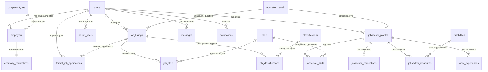

# ALDAWAN Job Portal - ERD Generator Code
## Ready-to-paste formats for ERD tools

---

## 🔧 **DBML FORMAT (dbdiagram.io)**
```dbml
// ALDAWAN Job Portal Database Schema
// Generated: October 22, 2025

// === USER MANAGEMENT ===
Table users {
  id bigint [pk, increment]
  name varchar
  email varchar [unique]
  password varchar
  role enum [default: 'JobSeeker'] // JobSeeker, FormalEmployer, InformalEmployer, Admin
  email_verified_at timestamp [null]
  remember_token varchar [null]
  created_at timestamp
  updated_at timestamp
}

Table admin_users {
  id bigint [pk, increment]
  user_id bigint [ref: - users.id, not null]
  admin_level enum [default: 'moderator'] // super_admin, admin, moderator
  permissions json [null]
  is_active boolean [default: true]
  last_login_at timestamp [null]
  department varchar [null]
  notes text [null]
  created_at timestamp
  updated_at timestamp
}

// === JOBSEEKER SYSTEM ===
Table jobseeker_profiles {
  id bigint [pk, increment]
  user_id bigint [ref: - users.id, not null]
  job_seeker_type enum [default: 'formal'] // formal, informal
  first_name varchar
  middle_name varchar [null]
  last_name varchar
  suffix varchar [null]
  birthday date [null]
  sex varchar [null]
  photo varchar [null]
  civilstatus varchar [null]
  street varchar [null]
  barangay varchar [null]
  municipality varchar [null]
  province varchar [null]
  religion varchar [null]
  contactnumber varchar [null]
  email varchar [null]
  is_4ps boolean [default: false]
  employmentstatus varchar [null]
  education_level_id bigint [ref: > education_levels.id, null]
  institution_name varchar [null]
  graduation_year year [null]
  gpa decimal(3,2) [null]
  degree_field varchar [null]
  created_at timestamp
  updated_at timestamp
}

Table work_experiences {
  id bigint [pk, increment]
  jobseeker_profile_id bigint [ref: > jobseeker_profiles.id, not null]
  job_title varchar
  company_name varchar
  description text [null]
  start_date date
  end_date date [null]
  is_current boolean [default: false]
  created_at timestamp
  updated_at timestamp
}

Table jobseeker_skills {
  id bigint [pk, increment]
  jobseeker_profile_id bigint [ref: > jobseeker_profiles.id, not null]
  skill_id bigint [ref: > skills.id, not null]
  proficiency_level enum [null] // beginner, intermediate, advanced, expert
  years_experience int [null]
  created_at timestamp
  updated_at timestamp
  
  indexes {
    (jobseeker_profile_id, skill_id) [unique]
  }
}

Table jobseeker_disabilities {
  id bigint [pk, increment]
  jobseeker_profile_id bigint [ref: > jobseeker_profiles.id, not null]
  disability_id bigint [ref: > disabilities.id, not null]
  accommodation_needs text [null]
  created_at timestamp
  updated_at timestamp
  
  indexes {
    (jobseeker_profile_id, disability_id) [unique]
  }
}

Table jobseeker_verifications {
  id bigint [pk, increment]
  jobseeker_id bigint [ref: > jobseeker_profiles.id, not null]
  status enum [default: 'pending'] // pending, approved, rejected, requires_info
  government_id_type varchar [null]
  government_id_number varchar [null]
  government_id_path varchar [null]
  barangay_clearance_path varchar [null]
  proof_of_address_path varchar [null]
  skill_certificates json [null]
  nbi_clearance_path varchar [null]
  verification_notes text [null]
  verified_by bigint [ref: > users.id, null]
  verified_at timestamp [null]
  submitted_at timestamp [default: 'now()']
  rejection_reason text [null]
  created_at timestamp
  updated_at timestamp
}

Table job_preferences {
  id bigint [pk, increment]
  user_id bigint [ref: > users.id, not null]
  preferred_job_title varchar
  preferred_classification varchar
  min_salary decimal(10,2) [null]
  max_salary decimal(10,2) [null]
  preferred_location varchar [null]
  preferred_employment_type enum [null] // full-time, part-time, contract, freelance, internship
  created_at timestamp
  updated_at timestamp
}

// === EMPLOYER SYSTEM ===
Table employers {
  id bigint [pk, increment]
  user_id bigint [ref: - users.id, not null]
  company_name varchar
  street varchar [null]
  barangay varchar [null]
  municipality varchar [null]
  province varchar [null]
  company_logo varchar [null]
  employer_type enum [default: 'formal'] // formal, informal
  company_type_id bigint [ref: > company_types.id, null]
  created_at timestamp
  updated_at timestamp
}

Table company_verifications {
  id bigint [pk, increment]
  employer_id bigint [ref: - employers.id, not null]
  status enum [default: 'pending'] // pending, approved, rejected, requires_info
  business_registration_number varchar [null]
  tax_id varchar [null]
  verification_document_path varchar [null]
  verification_notes text [null]
  verified_by bigint [ref: > users.id, null]
  verified_at timestamp [null]
  submitted_at timestamp [default: 'now()']
  rejection_reason text [null]
  created_at timestamp
  updated_at timestamp
}

// === JOB LISTING SYSTEM ===
Table job_listings {
  id bigint [pk, increment]
  job_title varchar
  description text
  requirements text
  company_id bigint [ref: > users.id, not null]
  location varchar
  salary decimal(10,2)
  classification varchar // legacy field
  job_type enum [default: 'formal'] // formal, informal
  employment_type enum [default: 'full_time'] // full_time, part_time, contract, temporary, internship
  status enum [default: 'open'] // open, closed
  posted_at timestamp [default: 'now()']
  minimum_education_level_id bigint [ref: > education_levels.id, null]
  minimum_experience_years int [default: 0]
  benefits text [null]
  remote_work_available boolean [default: false]
  positions_available int [default: 1]
  disability_restrictions json [null]
  accessibility_notes text [null]
  created_at timestamp
  updated_at timestamp
}

Table job_classifications {
  id bigint [pk, increment]
  job_listing_id bigint [ref: > job_listings.id, not null]
  classification_id bigint [ref: > classifications.id, not null]
  created_at timestamp
  updated_at timestamp
  
  indexes {
    (job_listing_id, classification_id) [unique]
  }
}

Table job_skills {
  id bigint [pk, increment]
  job_listing_id bigint [ref: > job_listings.id, not null]
  skill_id bigint [ref: > skills.id, not null]
  is_required boolean [default: false]
  created_at timestamp
  updated_at timestamp
}

Table formal_job_applications {
  id bigint [pk, increment]
  user_id bigint [ref: > users.id, not null]
  job_id bigint [ref: > job_listings.id, not null]
  status enum [default: 'pending'] // pending, under_review, shortlisted, accepted, rejected
  cover_letter text [null]
  resume_file_path varchar [null]
  additional_documents json [null]
  applied_at timestamp [default: 'now()']
  reviewed_at timestamp [null]
  status_updated_at timestamp [null]
  employer_notes text [null]
  rejection_reason text [null]
  created_at timestamp
  updated_at timestamp
  
  indexes {
    (user_id, job_id) [unique]
  }
}

// === LOOKUP/REFERENCE TABLES ===
Table skills {
  id bigint [pk, increment]
  name varchar [unique]
  description text [null]
  category varchar [null] // technical, soft, language
  is_active boolean [default: true]
  usage_count int [default: 0]
  show_in_list boolean [default: true]
  is_custom boolean [default: false]
  created_at timestamp
  updated_at timestamp
}

Table education_levels {
  id bigint [pk, increment]
  name varchar [unique]
  description text [null]
  level_order int [default: 0]
  is_active boolean [default: true]
  created_at timestamp
  updated_at timestamp
}

Table classifications {
  id bigint [pk, increment]
  name varchar [unique]
  description text [null]
  code varchar(10) [unique, null]
  is_active boolean [default: true]
  created_at timestamp
  updated_at timestamp
}

Table disabilities {
  id bigint [pk, increment]
  name varchar [unique]
  description text [null]
  category varchar [null] // physical, cognitive, sensory
  is_active boolean [default: true]
  created_at timestamp
  updated_at timestamp
}

Table company_types {
  id bigint [pk, increment]
  name varchar [unique]
  description text [null]
  is_active boolean [default: true]
  created_at timestamp
  updated_at timestamp
}

// === COMMUNICATION SYSTEM ===
Table messages {
  id bigint [pk, increment]
  sender_id bigint [ref: > users.id, not null]
  receiver_id bigint [ref: > users.id, not null]
  message_content text
  sent_at timestamp [default: 'now()']
  read_at timestamp [null]
  is_deleted_by_sender boolean [default: false]
  is_deleted_by_receiver boolean [default: false]
  message_type varchar [default: 'text']
  created_at timestamp
  updated_at timestamp
}

Table notifications {
  id bigint [pk, increment]
  user_id bigint [ref: > users.id, not null]
  type varchar
  title varchar
  message text
  data json [null]
  read_at timestamp [null]
  is_actionable boolean [default: false]
  action_url varchar [null]
  created_at timestamp
  updated_at timestamp
}

// === SYSTEM TABLES ===
Table sessions {
  id varchar [pk]
  user_id bigint [ref: > users.id, null]
  ip_address varchar(45) [null]
  user_agent text [null]
  payload longtext
  last_activity int
}

Table password_reset_tokens {
  email varchar [pk]
  token varchar
  created_at timestamp [null]
}

Table cache {
  key varchar [pk]
  value mediumtext
  expiration int
}
```

---

## 🔧 **SQL DDL FORMAT (Direct Database)**
```sql
-- ALDAWAN Job Portal Database Schema
-- Generated: October 22, 2025

-- USER MANAGEMENT
CREATE TABLE users (
    id BIGINT PRIMARY KEY AUTO_INCREMENT,
    name VARCHAR(255) NOT NULL,
    email VARCHAR(255) UNIQUE NOT NULL,
    password VARCHAR(255) NOT NULL,
    role ENUM('JobSeeker', 'FormalEmployer', 'InformalEmployer', 'Admin') DEFAULT 'JobSeeker',
    email_verified_at TIMESTAMP NULL,
    remember_token VARCHAR(100) NULL,
    created_at TIMESTAMP DEFAULT CURRENT_TIMESTAMP,
    updated_at TIMESTAMP DEFAULT CURRENT_TIMESTAMP ON UPDATE CURRENT_TIMESTAMP
);

CREATE TABLE admin_users (
    id BIGINT PRIMARY KEY AUTO_INCREMENT,
    user_id BIGINT NOT NULL,
    admin_level ENUM('super_admin', 'admin', 'moderator') DEFAULT 'moderator',
    permissions JSON NULL,
    is_active BOOLEAN DEFAULT TRUE,
    last_login_at TIMESTAMP NULL,
    department VARCHAR(255) NULL,
    notes TEXT NULL,
    created_at TIMESTAMP DEFAULT CURRENT_TIMESTAMP,
    updated_at TIMESTAMP DEFAULT CURRENT_TIMESTAMP ON UPDATE CURRENT_TIMESTAMP,
    FOREIGN KEY (user_id) REFERENCES users(id) ON DELETE CASCADE,
    UNIQUE KEY unique_user_admin (user_id)
);

-- LOOKUP TABLES
CREATE TABLE education_levels (
    id BIGINT PRIMARY KEY AUTO_INCREMENT,
    name VARCHAR(255) UNIQUE NOT NULL,
    description TEXT NULL,
    level_order INT DEFAULT 0,
    is_active BOOLEAN DEFAULT TRUE,
    created_at TIMESTAMP DEFAULT CURRENT_TIMESTAMP,
    updated_at TIMESTAMP DEFAULT CURRENT_TIMESTAMP ON UPDATE CURRENT_TIMESTAMP
);

CREATE TABLE skills (
    id BIGINT PRIMARY KEY AUTO_INCREMENT,
    name VARCHAR(255) UNIQUE NOT NULL,
    description TEXT NULL,
    category VARCHAR(255) NULL,
    is_active BOOLEAN DEFAULT TRUE,
    usage_count INT DEFAULT 0,
    show_in_list BOOLEAN DEFAULT TRUE,
    is_custom BOOLEAN DEFAULT FALSE,
    created_at TIMESTAMP DEFAULT CURRENT_TIMESTAMP,
    updated_at TIMESTAMP DEFAULT CURRENT_TIMESTAMP ON UPDATE CURRENT_TIMESTAMP
);

CREATE TABLE classifications (
    id BIGINT PRIMARY KEY AUTO_INCREMENT,
    name VARCHAR(255) UNIQUE NOT NULL,
    description TEXT NULL,
    code VARCHAR(10) UNIQUE NULL,
    is_active BOOLEAN DEFAULT TRUE,
    created_at TIMESTAMP DEFAULT CURRENT_TIMESTAMP,
    updated_at TIMESTAMP DEFAULT CURRENT_TIMESTAMP ON UPDATE CURRENT_TIMESTAMP
);

CREATE TABLE disabilities (
    id BIGINT PRIMARY KEY AUTO_INCREMENT,
    name VARCHAR(255) UNIQUE NOT NULL,
    description TEXT NULL,
    category VARCHAR(255) NULL,
    is_active BOOLEAN DEFAULT TRUE,
    created_at TIMESTAMP DEFAULT CURRENT_TIMESTAMP,
    updated_at TIMESTAMP DEFAULT CURRENT_TIMESTAMP ON UPDATE CURRENT_TIMESTAMP
);

CREATE TABLE company_types (
    id BIGINT PRIMARY KEY AUTO_INCREMENT,
    name VARCHAR(255) UNIQUE NOT NULL,
    description TEXT NULL,
    is_active BOOLEAN DEFAULT TRUE,
    created_at TIMESTAMP DEFAULT CURRENT_TIMESTAMP,
    updated_at TIMESTAMP DEFAULT CURRENT_TIMESTAMP ON UPDATE CURRENT_TIMESTAMP
);

-- JOBSEEKER SYSTEM
CREATE TABLE jobseeker_profiles (
    id BIGINT PRIMARY KEY AUTO_INCREMENT,
    user_id BIGINT NOT NULL,
    job_seeker_type ENUM('formal', 'informal') DEFAULT 'formal',
    first_name VARCHAR(255) NOT NULL,
    middle_name VARCHAR(255) NULL,
    last_name VARCHAR(255) NOT NULL,
    suffix VARCHAR(255) NULL,
    birthday DATE NULL,
    sex VARCHAR(255) NULL,
    photo VARCHAR(255) NULL,
    civilstatus VARCHAR(255) NULL,
    street VARCHAR(255) NULL,
    barangay VARCHAR(255) NULL,
    municipality VARCHAR(255) NULL,
    province VARCHAR(255) NULL,
    religion VARCHAR(255) NULL,
    contactnumber VARCHAR(255) NULL,
    email VARCHAR(255) NULL,
    is_4ps BOOLEAN DEFAULT FALSE,
    employmentstatus VARCHAR(255) NULL,
    education_level_id BIGINT NULL,
    institution_name VARCHAR(255) NULL,
    graduation_year YEAR NULL,
    gpa DECIMAL(3,2) NULL,
    degree_field VARCHAR(255) NULL,
    created_at TIMESTAMP DEFAULT CURRENT_TIMESTAMP,
    updated_at TIMESTAMP DEFAULT CURRENT_TIMESTAMP ON UPDATE CURRENT_TIMESTAMP,
    FOREIGN KEY (user_id) REFERENCES users(id) ON DELETE CASCADE,
    FOREIGN KEY (education_level_id) REFERENCES education_levels(id) ON DELETE SET NULL
);

CREATE TABLE work_experiences (
    id BIGINT PRIMARY KEY AUTO_INCREMENT,
    jobseeker_profile_id BIGINT NOT NULL,
    job_title VARCHAR(255) NOT NULL,
    company_name VARCHAR(255) NOT NULL,
    description TEXT NULL,
    start_date DATE NOT NULL,
    end_date DATE NULL,
    is_current BOOLEAN DEFAULT FALSE,
    created_at TIMESTAMP DEFAULT CURRENT_TIMESTAMP,
    updated_at TIMESTAMP DEFAULT CURRENT_TIMESTAMP ON UPDATE CURRENT_TIMESTAMP,
    FOREIGN KEY (jobseeker_profile_id) REFERENCES jobseeker_profiles(id) ON DELETE CASCADE
);

-- Continue with remaining tables...
```

---

## 🔧 **MERMAID FORMAT (GitHub/Markdown)**
